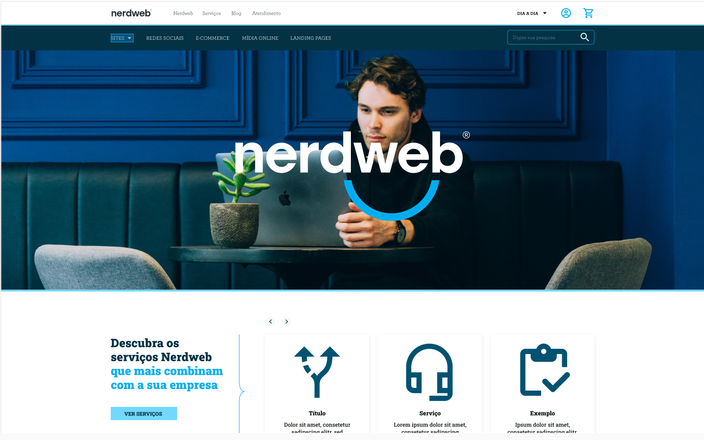

# | Projeto: Front-end NerdWeb.

Projeto de teste desenvolvido por [@evvvrado](https://www.linkedin.com/in/evvvrado/) com a finalidade de demonstração da minha capacidade.

Nesse projeto utilizei tecnologias como: [HTML5](https://developer.mozilla.org/pt-BR/docs/Web/HTML), [CSS3](https://developer.mozilla.org/pt-BR/docs/Web/CSS), [JavasScript](https://developer.mozilla.org/pt-BR/docs/Web/JavaScript) [Sass](https://sass-lang.com), [GSAP](https://greensock.com/). <strong>\*Não foi utilizado nenhum tipo de biblioteca ou framework</strong>
